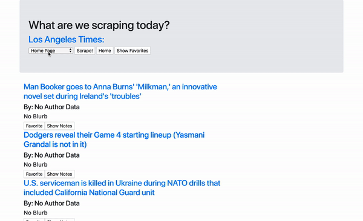

# newsScraper
I'm going to that scrape the [LA Times](http://www.latimes.com/) website for articles. Educational purposes only, don't sue me.

# Deployment
It's current [deployed](https://agile-crag-85432.herokuapp.com/)!

# Opening the Page
If you want to serve the file locally, after you run `npm install` just run  `node server.js` and you can check out the app at your localhost address. You will have to have mongoDB set up and running, so if you don't, you should look up how to.

# App Basics
This app will scrape the [LA Times](http://www.latimes.com/) website for articles. Specifically, it will scrape up the title, author, summary and link to article and save it all to our database while also displaying it to the user. You can scrape over 6-7 sections of their website, and even leave comments on what you think about the piece that is also saved into the database. You can even bookmark favorite articles and view them in the favorites section.

# See it in action!

<small>Fig 1. Not all articles have descriptions about them, but trust me, if you scrape enough they're there.<small>

# Built With

# Version
1.0.0

# Author
Daniel Hsu
